# Arquitectura del Sistema GILIA Backend

## Diagrama de Clases Principal

### Arquitectura General del Sistema

```mermaid
classDiagram
    %% Capa de Presentación (Controllers/Managers)
    class UsuarioManager {
        +obtenerTodos(req, res)
        +obtenerPorId(req, res)
        +crear(req, res)
        +actualizar(req, res)
        +eliminar(req, res)
        +login(req, res)
    }

    class NovedadManager {
        +obtenerTodos(req, res)
        +obtenerPorId(req, res)
        +crear(req, res)
        +actualizar(req, res)
        +eliminar(req, res)
    }

    class PersonaManager {
        +obtenerTodos(req, res)
        +obtenerPorId(req, res)
        +crear(req, res)
        +actualizar(req, res)
        +eliminar(req, res)
    }

    class ContenidoGaleriaManager {
        +obtenerTodos(req, res)
        +obtenerPorId(req, res)
        +crear(req, res)
        +actualizar(req, res)
        +eliminar(req, res)
    }

    class ContenidoExtensionManager {
        +obtenerTodos(req, res)
        +obtenerPorId(req, res)
        +crear(req, res)
        +actualizar(req, res)
        +eliminar(req, res)
    }

    class ContenidoHomeManager {
        +obtenerTodos(req, res)
        +obtenerPorId(req, res)
        +crear(req, res)
        +actualizar(req, res)
        +eliminar(req, res)
    }

    class ContenidoNovedadesManager {
        +obtenerTodos(req, res)
        +obtenerPorId(req, res)
        +crear(req, res)
        +actualizar(req, res)
        +eliminar(req, res)
    }

    class ContenidoPresentacionManager {
        +obtenerTodos(req, res)
        +obtenerPorId(req, res)
        +crear(req, res)
        +actualizar(req, res)
        +eliminar(req, res)
    }

    class ContenidoPublicacionesManager {
        +obtenerTodos(req, res)
        +obtenerPorId(req, res)
        +crear(req, res)
        +actualizar(req, res)
        +eliminar(req, res)
    }

    class ExtensionManager {
        +obtenerTodos(req, res)
        +obtenerPorId(req, res)
        +crear(req, res)
        +actualizar(req, res)
        +eliminar(req, res)
    }

    class InvestigacionManager {
        +obtenerTodos(req, res)
        +obtenerPorId(req, res)
        +crear(req, res)
        +actualizar(req, res)
        +eliminar(req, res)
    }

    class LineaExtensionManager {
        +obtenerTodos(req, res)
        +obtenerPorId(req, res)
        +crear(req, res)
        +actualizar(req, res)
        +eliminar(req, res)
    }

    class LineaInvestigacionManager {
        +obtenerTodos(req, res)
        +obtenerPorId(req, res)
        +crear(req, res)
        +actualizar(req, res)
        +eliminar(req, res)
    }

    class ObjetivoManager {
        +obtenerTodos(req, res)
        +obtenerPorId(req, res)
        +crear(req, res)
        +actualizar(req, res)
        +eliminar(req, res)
    }

    class ProyectoManager {
        +obtenerTodos(req, res)
        +obtenerPorId(req, res)
        +crear(req, res)
        +actualizar(req, res)
        +eliminar(req, res)
    }

    class PublicacionManager {
        +obtenerTodos(req, res)
        +obtenerPorId(req, res)
        +crear(req, res)
        +actualizar(req, res)
        +eliminar(req, res)
    }

    class SeccionGaleriaManager {
        +obtenerTodos(req, res)
        +obtenerPorId(req, res)
        +crear(req, res)
        +actualizar(req, res)
        +eliminar(req, res)
    }

    class TarjetaFlotanteManager {
        +obtenerTodos(req, res)
        +obtenerPorId(req, res)
        +crear(req, res)
        +actualizar(req, res)
        +eliminar(req, res)
    }

    class ContenidoEquipoManager {
        +obtenerTodos(req, res)
        +obtenerPorId(req, res)
        +crear(req, res)
        +actualizar(req, res)
        +eliminar(req, res)
    }

    %% Capa de Servicios
    class BaseService {
        -repository: BaseRepository
        +findAll(options)
        +findById(id, relations)
        +create(data)
        +update(id, data)
        +delete(id)
        +count(options)
    }

    %% Capa de Repositorios
    class BaseRepository {
        <<abstract>>
        +findAll(options)*
        +findById(id)*
        +create(data)*
        +update(id, data)*
        +delete(id)*
        +count(options)*
        +findWithRelations(id, relations)*
    }

    class JsonRepository {
        -tableName: string
        -dbPath: string
        +findAll(options)
        +findById(id)
        +create(data)
        +update(id, data)
        +delete(id)
        +count(options)
        +findWithRelations(id, relations)
        -_readDb()
        -_writeDb(db)
        -_generateId(items)
        -_applyFilters(items, options)
        -_applyPagination(items, options)
        -_applySorting(items, options)
        -_getDefaultDb()
    }

    class SequelizeRepository {
        -model: SequelizeModel
        +findAll(options)
        +findById(id, options)
        +create(data)
        +update(id, data)
        +delete(id)
        +count(options)
        +findWithRelations(id, relations)
    }

    class RepositoryFactory {
        +create(tableName, model)$ BaseRepository
    }

    %% Utilidades
    class ResponseHelper {
        +success(res, data, message, statusCode)$
        +successWithPagination(res, data, pagination, message)$
        +created(res, data, message)$
        +error(res, message, statusCode, error)$
        +notFound(res, message)$
        +badRequest(res, message, errors)$
        +unauthorized(res, message)$
        +forbidden(res, message)$
    }

    class ValidationHelper {
        +validatePagination(query)$
        +validateEmail(email)$
        +validateUrl(url)$
        +sanitizeString(str)$
        +validateRequired(fields, data)$
    }

    class Constants {
        +USER_ROLES$
        +STATUS$
        +PAGINATION$
        +VALIDATION$
        +MESSAGES$
    }

    %% Relaciones entre clases
    UsuarioManager --> BaseService : usa
    NovedadManager --> BaseService : usa
    PersonaManager --> BaseService : usa
    ContenidoGaleriaManager --> BaseService : usa
    ContenidoExtensionManager --> BaseService : usa
    ContenidoHomeManager --> BaseService : usa
    ContenidoNovedadesManager --> BaseService : usa
    ContenidoPresentacionManager --> BaseService : usa
    ContenidoPublicacionesManager --> BaseService : usa
    ExtensionManager --> BaseService : usa
    InvestigacionManager --> BaseService : usa
    LineaExtensionManager --> BaseService : usa
    LineaInvestigacionManager --> BaseService : usa
    ObjetivoManager --> BaseService : usa
    ProyectoManager --> BaseService : usa
    PublicacionManager --> BaseService : usa
    SeccionGaleriaManager --> BaseService : usa
    TarjetaFlotanteManager --> BaseService : usa
    ContenidoEquipoManager --> BaseService : usa
    
    BaseService --> BaseRepository : usa
    
    BaseRepository <|-- JsonRepository : implementa
    BaseRepository <|-- SequelizeRepository : implementa
    
    RepositoryFactory --> BaseRepository : crea
    RepositoryFactory --> JsonRepository : instancia
    RepositoryFactory --> SequelizeRepository : instancia
    
    UsuarioManager --> ResponseHelper : usa
    NovedadManager --> ResponseHelper : usa
    PersonaManager --> ResponseHelper : usa
    ContenidoGaleriaManager --> ResponseHelper : usa
    ContenidoExtensionManager --> ResponseHelper : usa
    ContenidoHomeManager --> ResponseHelper : usa
    ContenidoNovedadesManager --> ResponseHelper : usa
    ContenidoPresentacionManager --> ResponseHelper : usa
    ContenidoPublicacionesManager --> ResponseHelper : usa
    ExtensionManager --> ResponseHelper : usa
    InvestigacionManager --> ResponseHelper : usa
    LineaExtensionManager --> ResponseHelper : usa
    LineaInvestigacionManager --> ResponseHelper : usa
    ObjetivoManager --> ResponseHelper : usa
    ProyectoManager --> ResponseHelper : usa
    PublicacionManager --> ResponseHelper : usa
    SeccionGaleriaManager --> ResponseHelper : usa
    TarjetaFlotanteManager --> ResponseHelper : usa
    ContenidoEquipoManager --> ResponseHelper : usa
    
    UsuarioManager --> ValidationHelper : usa
    NovedadManager --> ValidationHelper : usa
    PersonaManager --> ValidationHelper : usa
    ContenidoGaleriaManager --> ValidationHelper : usa
    ContenidoExtensionManager --> ValidationHelper : usa
    ContenidoHomeManager --> ValidationHelper : usa
    ContenidoNovedadesManager --> ValidationHelper : usa
    ContenidoPresentacionManager --> ValidationHelper : usa
    ContenidoPublicacionesManager --> ValidationHelper : usa
    ExtensionManager --> ValidationHelper : usa
    InvestigacionManager --> ValidationHelper : usa
    LineaExtensionManager --> ValidationHelper : usa
    LineaInvestigacionManager --> ValidationHelper : usa
    ObjetivoManager --> ValidationHelper : usa
    ProyectoManager --> ValidationHelper : usa
    PublicacionManager --> ValidationHelper : usa
    SeccionGaleriaManager --> ValidationHelper : usa
    TarjetaFlotanteManager --> ValidationHelper : usa
    ContenidoEquipoManager --> ValidationHelper : usa
    
    BaseService --> Constants : usa
    ValidationHelper --> Constants : usa
    ResponseHelper --> Constants : usa
```



## Estructura de Directorios

```
gilia-web-backend/
├── src/
│   ├── managers/           # Capa de presentación (Controllers)
│   │   ├── UsuarioManager.js
│   │   ├── NovedadManager.js
│   │   ├── PersonaManager.js
│   │   ├── ContenidoGaleriaManager.js
│   │   ├── ContenidoExtensionManager.js
│   │   ├── ContenidoHomeManager.js
│   │   ├── ContenidoNovedadesManager.js
│   │   ├── ContenidoPresentacionManager.js
│   │   ├── ContenidoPublicacionesManager.js
│   │   ├── ExtensionManager.js
│   │   ├── InvestigacionManager.js
│   │   ├── LineaExtensionManager.js
│   │   ├── LineaInvestigacionManager.js
│   │   ├── ObjetivoManager.js
│   │   ├── ProyectoManager.js
│   │   ├── PublicacionManager.js
│   │   ├── SeccionGaleriaManager.js
│   │   ├── TarjetaFlotanteManager.js
│   │   └── ContenidoEquipoManager.js
│   ├── service/            # Capa de servicios
│   │   └── BaseService.js
│   ├── repositories/       # Capa de repositorios
│   │   ├── BaseRepository.js
│   │   ├── JsonRepository.js
│   │   ├── SequelizeRepository.js
│   │   └── RepositoryFactory.js
│   ├── routes/             # Definición de rutas
│   │   ├── index.js
│   │   ├── usuarioRoutes.js
│   │   ├── novedadRoutes.js
│   │   ├── personaRoutes.js
│   │   └── ... (otros archivos de rutas)
│   ├── utils/              # Utilidades
│   │   ├── responseHelper.js
│   │   └── validationHelper.js
│   ├── config/             # Configuración
│   │   └── constants.js
│   ├── models/             # Modelos de datos
│   ├── database/           # Base de datos JSON
│   ├── middleware/         # Middleware
│   └── server.js           # Punto de entrada
├── index.js                # Configuración principal
└── package.json
```

## Patrones de Diseño Utilizados

### 1. Factory Pattern
- **RepositoryFactory**: Crea instancias de repositorios según la configuración (JSON o Sequelize)

### 2. Repository Pattern
- **BaseRepository**: Interfaz abstracta para operaciones de datos
- **JsonRepository**: Implementación para almacenamiento JSON
- **SequelizeRepository**: Implementación para base de datos SQL

### 3. Service Layer Pattern
- **BaseService**: Capa de lógica de negocio que utiliza repositorios

### 4. Manager Pattern
- **Managers**: Controladores que manejan las peticiones HTTP y utilizan servicios

### 5. Helper Pattern
- **ResponseHelper**: Utilidades para respuestas HTTP estandarizadas
- **ValidationHelper**: Utilidades para validación de datos

## Flujo de Datos

1. **Request HTTP** → **Routes** → **Manager**
2. **Manager** → **BaseService** → **Repository** (via RepositoryFactory)
3. **Repository** → **Database** (JSON o SQL)
4. **Response** → **ResponseHelper** → **Client**

## Configuración de Base de Datos

El sistema soporta dos modos de almacenamiento:

- **JSON Mode** (default): Almacena datos en archivos JSON
- **Database Mode**: Utiliza Sequelize con base de datos SQL

La configuración se controla mediante la variable de entorno `USE_DATABASE`.
