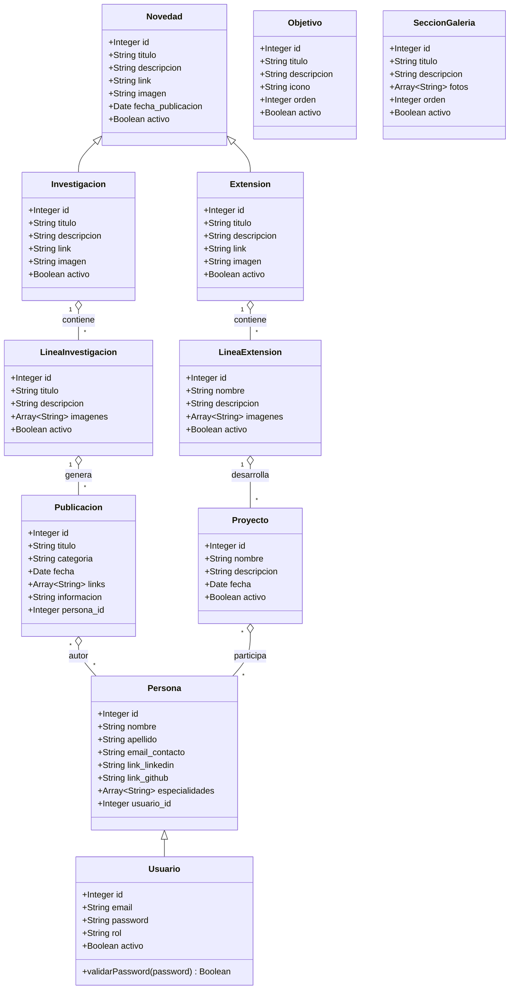
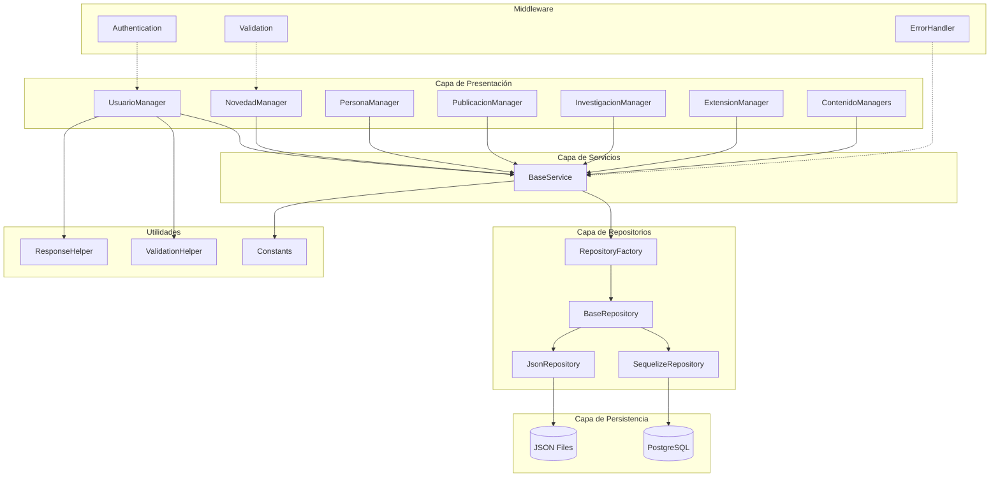
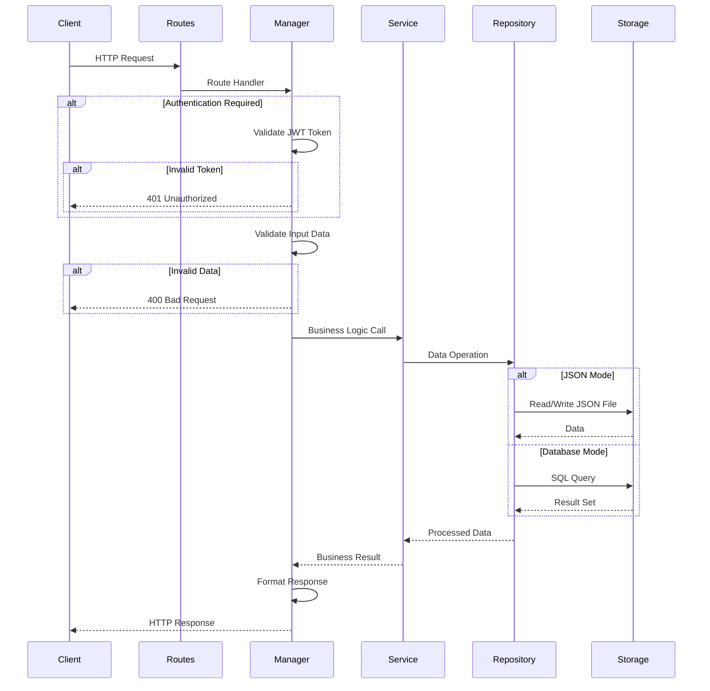
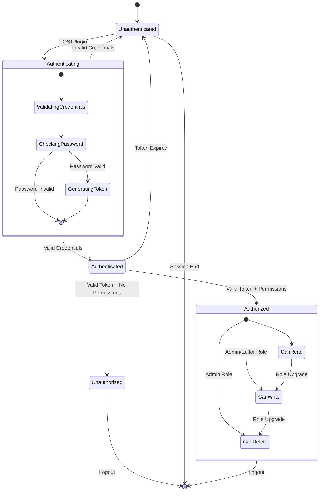
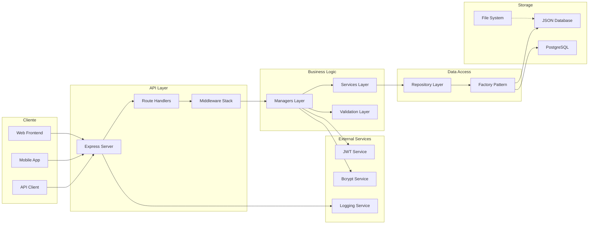
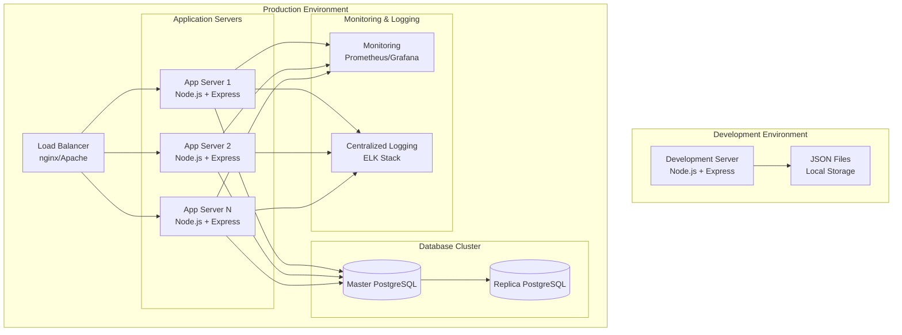

# Documentación Técnica - GILIA Backend

## Diagramas de Arquitectura y Diseño

### 1. Diagrama de Clases del Dominio

### 2. Diagrama de Clases de Contenido Dinámico

```mermaid
classDiagram
    %% Entidades de Contenido de la Interfaz
    class ContenidoHome {
        +Integer id
        +String titulo
        +String descripcion
        +Boolean activo
        +Date created_at
        +Date updated_at
    }

    class ContenidoPresentacion {
        +Integer id
        +String titulo
        +String descripcion
        +String texto_boton_1
        +String texto_boton_2
        +Boolean activo
        +Date created_at
        +Date updated_at
    }

    class ContenidoNovedades {
        +Integer id
        +String titulo
        +String descripcion
        +Array~String~ palabras_magicas
        +Boolean activo
        +Date created_at
        +Date updated_at
    }

    class ContenidoPublicaciones {
        +Integer id
        +String titulo
        +String descripcion
        +Boolean activo
        +Date created_at
        +Date updated_at
    }

    class ContenidoExtension {
        +Integer id
        +String titulo
        +String descripcion
        +Boolean activo
        +Date created_at
        +Date updated_at
    }

    class ContenidoEquipo {
        +Integer id
        +String titulo
        +String descripcion
        +Boolean activo
        +Date created_at
        +Date updated_at
    }

    class ContenidoGaleria {
        +Integer id
        +String titulo
        +String descripcion
        +Boolean activo
        +Date created_at
        +Date updated_at
    }

    class TarjetaFlotante {
        +Integer id
        +String titulo
        +String descripcion_corta
        +Integer orden
        +Boolean activo
        +Date created_at
        +Date updated_at
    }

    %% Componentes de UI que gestionan el contenido
    class HomePageComponent {
        +renderHero()
        +renderObjectives()
        +renderFloatingCards()
        +renderLatestNews()
    }

    class PresentationPageComponent {
        +renderIntroduction()
        +renderMission()
        +renderVision()
        +renderActionButtons()
    }

    class NewsPageComponent {
        +renderNewsList()
        +renderFilters()
        +renderPagination()
        +renderMagicWords()
    }

    class PublicationsPageComponent {
        +renderPublicationsList()
        +renderCategoryFilter()
        +renderAuthorFilter()
        +renderDateFilter()
    }

    class TeamPageComponent {
        +renderTeamMembers()
        +renderMemberDetails()
        +renderSpecialties()
        +renderContactInfo()
    }

    class GalleryPageComponent {
        +renderGallerySections()
        +renderImageGrid()
        +renderImageModal()
        +renderSectionNavigation()
    }

    %% Relaciones entre contenido y componentes
    ContenidoHome --> HomePageComponent : "alimenta"
    ContenidoPresentacion --> PresentationPageComponent : "alimenta"
    ContenidoNovedades --> NewsPageComponent : "alimenta"
    ContenidoPublicaciones --> PublicationsPageComponent : "alimenta"
    ContenidoEquipo --> TeamPageComponent : "alimenta"
    ContenidoGaleria --> GalleryPageComponent : "alimenta"
    TarjetaFlotante --> HomePageComponent : "alimenta"
```

### 3. Diagrama de Arquitectura del Sistema

### 4. Diagrama de Flujo de Peticiones HTTP

### 5. Diagrama de Estados de Autenticación

### 6. Diagrama de Componentes del Sistema

### 7. Diagrama de Despliegue

